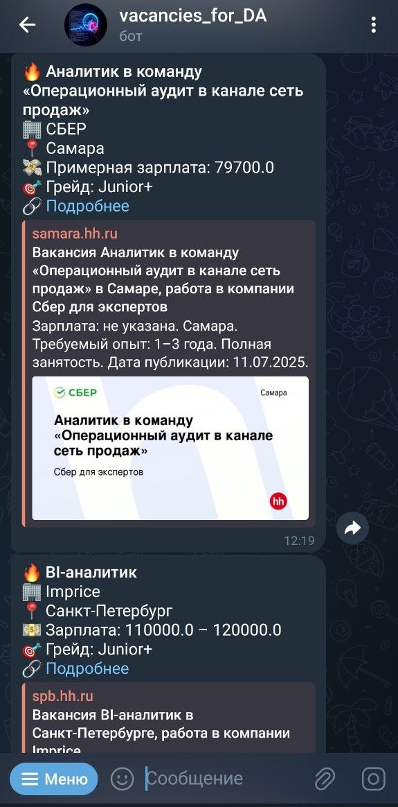

# 🤖 Вакансии дата аналитики на HH: Парсинг-бот для Telegram

[](https://python.org)
[](https://core.telegram.org/bots)

Бот для автоматического парсинга вакансий дата аналитика (bi/продуктовый аналитик) с hh.ru и отправки уведомлений в Telegram. Способен отправлять вакансии в формате рассылки. 

## 🔍 Обзор
Бот парсит вакансии для аналитиков данных с hh.ru и присылает новые вакансии в Telegram. Решает проблему ручного мониторинга hh.ru, экономя время соискателей, а также предоставляет возможность откликнуться на вакансию одним из первых.

## ⚙️ Функционал
- ✅ Парсинг вакансий дата аналитиков с hh.ru   
- ✅ Предсказывает грейд и возможную зарплату  
- ✅ Регулярные автоматические проверки новых вакансий  
- ✅ Хранение данных о вакансиях в облаке
- ✅ Автоматически обновляемый дашборд в DataLens

## 🛠️ Технологии
- **Язык:** Python 3.12+
- **Библиотеки:** 
  - `aiogram`- бот
  - `aiohttp`/`BeautifulSoup` - парсинг
  - `asyncpg` - база данных
  - `logging` -  логирования событий
- **Хранение данных:** PostgreSQL

## ⚡️ Установка
### 1. Клонируйте репозиторий:
```bash
git clone https://github.com/zhuikovva/vacancies_hh_parsing_bot.git
```

### 2. Установите зависимости:
```bash
pip install -r requirements.txt
```
### 3. Создайте бота в @BotFather и получите токен
### 4. Вставьте токен в config.py:
```BOT_TOKEN = "ВАШ_ТОКЕН"```

## ⚙️ Конфигурация (`config.py`)
- `BOT_TOKEN` — токен Telegram-бота
- `DATABASE` — база данных
- `DB_HOST` — адрес базы данных
- `DB_USER` — user_name базы аданных
- `DB_PASSWORD` — пароль от базы данных
- `DB_PORT` — порт базы данных
---

## 🚀 Использование
Запустите бота:
```bash
python bot.py
```

### Команды в боте:
/start: 'Начало работы с ботом',

/help: 'Вывести справку',

/subscribe: 'Подписаться на рассылку',

/unsubscribe: 'Отписаться от рассылки',

/status: 'Посмотреть статус подписки',

/set_interval 15: 'Установить интервал обновления (проверять вакансии каждые 15 минут)'

## 📸 Cкриншот интерфейса:

<p align="center">
  
  <br>
  <em>Главное меню бота</em>
</p>

## 📌 План развития
- [ ] Добавление фильтров по зарплате/грейду
- [ ] Добавление данных для data scienсe, системных/бизнес аналитиков
- [ ] Дообучение моделей catboost

## 📜 Лицензия
[MIT](https://choosealicense.com/licenses/mit/)

## 📬 Контакты
Ваше имя - [@zhuikovva](https://github.com/zhuikovva)  
TG: @ZhuikovVsevolod
Идеи/предложения: vsevolod1905@yandex.ru
